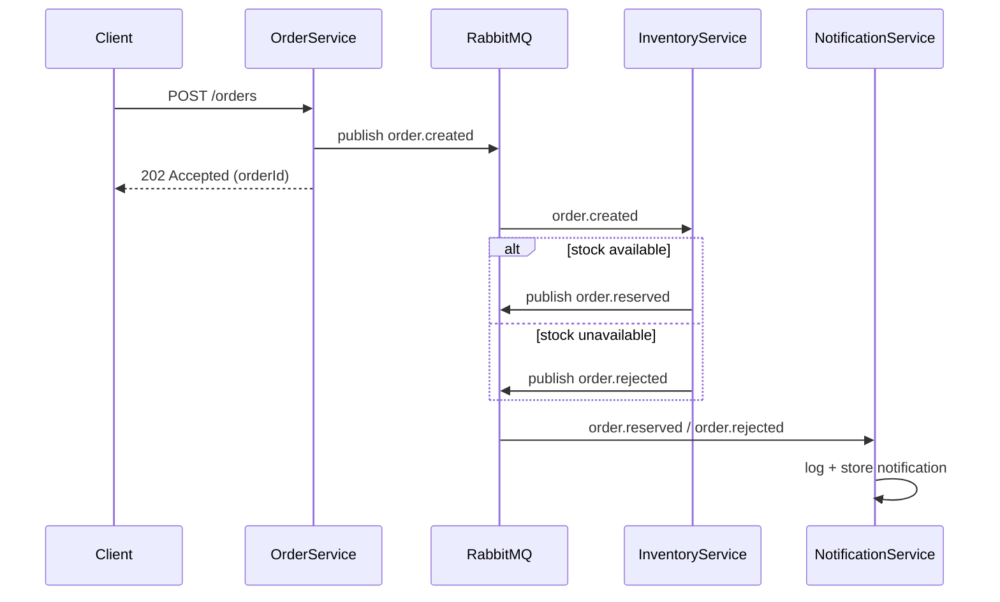

# rabbitmq-microservices-demo

A minimal, open-source reference implementation of event-driven
microservices with RabbitMQ and .NET 10. Three services — OrderService,
InventoryService, NotificationService — communicate exclusively through
events on a topic exchange, demonstrating three patterns in one runnable
system: **topic-exchange routing** (`order.created` / `order.reserved` /
`order.rejected`), **competing consumers** (scale InventoryService to
multiple replicas sharing one queue), and **dead-lettering** (malformed
messages route to `orders.dead-letter` for inspection). There is no
database, no auth, no UI — state lives in memory so the messaging
behavior stays the star of `docker compose logs -f`.

## Architecture



See [docs/architecture.md](docs/architecture.md) for the full exchange/
queue topology, event schemas, failure semantics, and which service
declares which topology pieces.

| Service              | Host port | Endpoints |
|----------------------|-----------|-----------|
| OrderService         | 5001      | `POST /orders`, `GET /health` |
| InventoryService     | 5002      | `GET /stock`, `GET /health`   |
| NotificationService  | 5003      | `GET /notifications`, `GET /health` |

## Prerequisites

- Docker with Docker Compose v2.24 or newer (needed for the `!reset`
  tag used by the scaling override; any recent Docker Desktop is fine).
- Optionally the .NET 10 SDK to run services locally against a broker on
  `localhost:5672`.

## Quickstart

```bash
docker compose up --build
```

This starts RabbitMQ (with management plugin), declares all exchanges,
queues, and bindings from inside the services at startup, and waits for
the broker healthcheck before launching anything.

Once the stack is up, place an order for each demo scenario:

```bash
# Success case: SKU-WIDGET starts at 50 units
curl -X POST localhost:5001/orders -H 'Content-Type: application/json' \
  -d '{"sku":"SKU-WIDGET","quantity":1,"customerEmail":"a@b.com"}'
# -> 202 Accepted {"orderId":"...","status":"submitted"}

# Insufficient stock case: SKU-GADGET has only 10 units
curl -X POST localhost:5001/orders -H 'Content-Type: application/json' \
  -d '{"sku":"SKU-GADGET","quantity":99,"customerEmail":"a@b.com"}'
# -> 202 Accepted; outcome is a business rejection (insufficient_stock)

# Unknown SKU case
curl -X POST localhost:5001/orders -H 'Content-Type: application/json' \
  -d '{"sku":"SKU-UNKNOWN","quantity":1,"customerEmail":"a@b.com"}'
# -> 202 Accepted; outcome is a business rejection (unknown_sku)
```

Every request returns `202 Accepted` immediately — OrderService publishes
the event (awaiting only the broker's publisher confirm) and never waits
on downstream processing.

Watch the full flow in the logs:

```bash
docker compose logs -f
```

Then confirm the outcomes:

```bash
# Current stock (SKU-WIDGET should now be 49)
curl localhost:5002/stock

# Notification records, most recent first
curl localhost:5003/notifications

# The log is a bounded ring buffer; page through it with limit/offset
curl 'localhost:5003/notifications?limit=20&offset=0'
```

Seed stock: `SKU-WIDGET` = 50, `SKU-GADGET` = 10, `SKU-GIZMO` = 0
(ordering 1x `SKU-GIZMO` is another easy rejection case).

## RabbitMQ management UI

Open <http://localhost:15672> and sign in with `guest` / `guest`.
Things worth looking at:

- **Exchanges** tab: `orders.topic` (topic) carries all lifecycle
  events; `orders.dlx` (fanout) receives dead-lettered messages.
- **Queues** tab: `inventory.order-created`,
  `notification.order-reserved`, `notification.order-rejected`, and
  `orders.dead-letter`. Click `inventory.order-created` to see its
  `x-dead-letter-exchange` argument.
- **Message rates**: fire a few orders via the quickstart curls and
  watch publish/deliver/ack rates spike on the graphs.

## Dead-letter queue demo

Send a deliberately malformed message straight onto
`inventory.order-created`:

1. In the management UI, go to **Queues** -> `inventory.order-created`
   -> **Publish message**.
2. Paste `this is not json` as the payload and click **Publish message**.
3. InventoryService fails to deserialize it, nacks without requeue, and
   the message lands in `orders.dead-letter`. Check under
   **Queues** -> `orders.dead-letter` -> **Get Message(s)**, and look
   for the warning line in `docker compose logs inventory-service`.

Prefer the terminal? The same thing via the management HTTP API
(publishing through the default exchange with the queue name as routing
key):

```bash
curl -u guest:guest -X POST \
  localhost:15672/api/exchanges/%2F/amq.default/publish \
  -H 'Content-Type: application/json' \
  -d '{"properties":{"content_type":"application/json","delivery_mode":2},"routing_key":"inventory.order-created","payload":"dGhpcyBpcyBub3QganNvbg==","payload_encoding":"base64"}'

# Inspect what landed in the DLQ:
curl -u guest:guest -X POST \
  localhost:15672/api/queues/%2F/orders.dead-letter/get \
  -H 'Content-Type: application/json' \
  -d '{"count":10,"ackmode":"ack_requeue_true","encoding":"auto","truncate":50000}'
```

Note that business rejections (unknown SKU / insufficient stock) do
*not* dead-letter — those are normal domain outcomes published as
`order.rejected`. Only malformed messages end up in the DLQ.

## Scaling InventoryService (competing consumers)

All replicas share the single `inventory.order-created` queue, and
RabbitMQ distributes messages between them round-robin.

The base compose file publishes inventory-service on fixed host port
5002, which only works for one replica. To scale, uncomment the
`ports: !reset []` block in `docker-compose.override.yml`, then run:

```bash
docker compose up --build --scale inventory-service=3
```

Tradeoff: without a fixed host port mapping, individual replicas are no
longer reachable from the host (`GET /stock` included). The behavior is
still fully observable through `docker compose logs -f` — every replica
logs its container hostname, and the artificial processing delay makes
the round-robin split obvious:

```
[16:19:11 INF] (0a67abb4fb62) Order ... reserved SKU-WIDGET x1, 49 left in stock
[16:19:12 INF] (faa7dd210d49) Order ... rejected (unknown_sku) for SKU-UNKNOWN x1
```

### Consumer tuning

Consumers are configured via the `Consuming` section (env-var form:
`Consuming__<Property>`), applied by both consuming services:

| Setting | Default | Purpose |
|---------|---------|---------|
| `PrefetchCount` | 16 | Unacked messages fetched per consumer; keep ≥ dispatch concurrency |
| `ConsumerDispatchConcurrency` | 8 | Concurrent deliveries processed per channel (1 = strict sequential) |
| `SimulatedProcessingDelayEnabled` | `true` | **Demo-only** artificial latency so round-robin splitting is visible in logs |
| `MinProcessingDelayMilliseconds` / `MaxProcessingDelayMilliseconds` | 300 / 800 | Delay range used when the simulated delay is enabled |

The simulated delay exists purely for the demo narrative and caps each
replica at roughly 2 orders/second — **disable it for any load testing**:

```bash
SIMULATED_PROCESSING_DELAY_ENABLED=false \
CONSUMING_PREFETCH_COUNT=64 CONSUMING_DISPATCH_CONCURRENCY=32 \
  docker compose up --build
```

When running services locally (`dotnet run`), set the same values as
plain environment variables, e.g. `Consuming__SimulatedProcessingDelayEnabled=false`.

To return to the single-replica setup, re-comment the block and run
`docker compose up -d --force-recreate`.

## Project structure

```
├── docker-compose.yml            # broker + three services
├── docs/architecture.md          # topology, schemas, failure semantics
├── src/
│   ├── OrderService/             # POST /orders, publishes order.created
│   ├── InventoryService/         # consumes order.created, reserves stock
│   └── NotificationService/      # consumes both outcomes, GET /notifications
├── shared/Shared.Messaging/      # EventEnvelope + RabbitMqOptions only
└── tests/                        # xUnit unit tests per service
```

Each service owns its own event payload models and its own Dockerfile;
`Shared.Messaging` holds just the envelope contract and connection
options, mirroring how independently deployed services would agree on a
JSON schema rather than compiled types. Details in
[docs/architecture.md](docs/architecture.md).

## Out of scope

Deliberately not implemented, so nobody goes looking for them:

- Authentication/authorization (anywhere)
- Persistent storage / database (state is in-memory)
- Retry/backoff or compensation on business rejection (a rejected order
  is terminal; this is not a saga demo)
- Distributed tracing (OpenTelemetry would be a natural follow-up)
- Kubernetes manifests (docker-compose only)

## Known limitations

Performance-oriented gaps a production deployment would close, left as-is
on purpose:

- **No queue length limits / broker backpressure** (`x-max-length` +
  `overflow=reject-publish` absent) — demo traffic never saturates the
  broker, and publisher confirms already surface any broker-side failure.
- **Single shared publisher channel per service** (no channel pool or
  publish retry) — one channel comfortably covers demo throughput, and a
  pool would add machinery that obscures the messaging patterns.
- **Synchronous console logging at Information per message** — the
  human-readable `docker compose logs -f` narrative is a deliverable;
  async buffering trades log immediacy for throughput.

## License

MIT — see [LICENSE](LICENSE).
