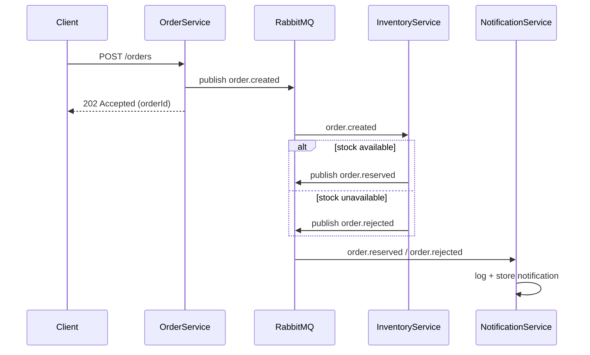

# Project Spec: RabbitMQ Microservices Showcase (.NET 10)

## 1. Purpose

Build a small, open-source reference repository demonstrating event-driven microservice architecture using RabbitMQ as the message broker. The project is intentionally minimal: no database, no auth, no UI. The goal is to make the messaging patterns (topic exchange routing, competing consumers, dead-lettering) legible to someone reading the code or watching the logs, not to build a production system.

Target audience: developers evaluating RabbitMQ + .NET for microservices, or learning the patterns.

## 2. Tech Stack

- **.NET 10** (use minimal APIs, no MVC controllers)
- **RabbitMQ.Client** v7.x (official client, async API)
- **RabbitMQ 3.13+** with management plugin enabled
- **Docker Compose** for orchestration (RabbitMQ + all services)
- **Serilog** with console sink, structured logging, for visible message flow in `docker-compose logs -f`
- No ORM, no database. Services hold state in-memory (`ConcurrentDictionary`) where state is needed at all.
- No authentication/authorization anywhere. This is out of scope.

## 3. Repository Structure

```
/rabbitmq-microservices-demo
├── docker-compose.yml
├── README.md
├── .gitignore
├── .editorconfig
├── docs/
│   ├── architecture.md          # sequence diagrams, exchange topology
│   └── images/                  # rendered diagram exports (optional)
├── src/
│   ├── OrderService/
│   │   ├── OrderService.csproj
│   │   ├── Program.cs
│   │   ├── Dockerfile
│   │   ├── Models/
│   │   │   ├── Order.cs
│   │   │   └── OrderCreatedEvent.cs
│   │   ├── Messaging/
│   │   │   ├── RabbitMqPublisher.cs
│   │   │   └── RabbitMqConnectionFactory.cs
│   │   └── appsettings.json
│   ├── InventoryService/
│   │   ├── InventoryService.csproj
│   │   ├── Program.cs
│   │   ├── Dockerfile
│   │   ├── Models/
│   │   │   ├── InventoryItem.cs
│   │   │   ├── OrderReservedEvent.cs
│   │   │   └── OrderRejectedEvent.cs
│   │   ├── Messaging/
│   │   │   ├── OrderCreatedConsumer.cs
│   │   │   ├── RabbitMqPublisher.cs
│   │   │   └── RabbitMqConnectionFactory.cs
│   │   └── appsettings.json
│   └── NotificationService/
│       ├── NotificationService.csproj
│       ├── Program.cs
│       ├── Dockerfile
│       ├── Models/
│       │   └── NotificationRecord.cs
│       ├── Messaging/
│       │   ├── OrderReservedConsumer.cs
│       │   ├── OrderRejectedConsumer.cs
│       │   └── RabbitMqConnectionFactory.cs
│       └── appsettings.json
├── shared/
│   └── Shared.Messaging/
│       ├── Shared.Messaging.csproj
│       ├── EventEnvelope.cs
│       └── RabbitMqOptions.cs
└── RabbitMqMicroservicesDemo.sln
```

Each service is a standalone deployable unit with its own `Dockerfile` and `.csproj`. A small `Shared.Messaging` class library holds only the message envelope contract and connection options, no business logic, to keep services genuinely decoupled (as they would be if written in different languages/repos in real life).

## 4. Message Flow / Architecture

### 4.1 Exchange topology

| Exchange           | Type  | Durable | Purpose                                    |
|---------------------|-------|---------|---------------------------------------------|
| `orders.topic`       | topic | yes     | All order lifecycle events                  |
| `orders.dlx`          | fanout| yes     | Dead-letter exchange for rejected/failed messages |

### 4.2 Queues and bindings

| Queue                        | Bound to        | Routing key(s)        | Consumer            | Notes |
|-------------------------------|------------------|------------------------|-----------------------|-------|
| `inventory.order-created`     | `orders.topic`   | `order.created`         | InventoryService      | DLX configured: `orders.dlx` |
| `notification.order-reserved` | `orders.topic`   | `order.reserved`        | NotificationService    | |
| `notification.order-rejected` | `orders.topic`   | `order.rejected`        | NotificationService    | |
| `orders.dead-letter`          | `orders.dlx`     | (fanout, no key)        | none (inspect via UI) | Terminal queue for poison messages |

### 4.3 Routing keys

- `order.created`
- `order.reserved`
- `order.rejected`

### 4.4 Sequence of events

1. Client sends `POST /orders` to OrderService.
2. OrderService validates request shape, generates `OrderId` (GUID), publishes `order.created` to `orders.topic`.
3. OrderService immediately returns `202 Accepted` with the order ID. It does not wait for downstream processing.
4. InventoryService consumes `order.created`.
   - If the requested SKU exists in its in-memory stock table and quantity is available: decrement stock, publish `order.reserved`.
   - If SKU is unknown or quantity insufficient: publish `order.rejected` with a reason.
   - If the message body fails to deserialize or is missing required fields: reject the message without requeue (`basicNack` with `requeue: false`), which routes it to the DLX per queue config.
5. NotificationService consumes both `order.reserved` and `order.rejected`, logs a formatted "notification sent" line (mock, no real email/SMS integration), and stores the record in an in-memory list exposed via `GET /notifications`.

### 4.5 Mermaid sequence diagram (put this in docs/architecture.md)



## 5. Service Specifications

### 5.1 OrderService

**Responsibility:** Accept order requests over HTTP, publish `order.created` events. Synchronous hot path, does not wait on downstream services.

**Endpoints:**
- `POST /orders`
  - Request body: `{ "sku": "string", "quantity": int, "customerEmail": "string" }`
  - Validates: sku non-empty, quantity > 0, customerEmail is a plausible email string
  - On success: publishes event, returns `202 Accepted` with `{ "orderId": "guid", "status": "submitted" }`
  - On validation failure: `400 Bad Request` with error detail, no publish
- `GET /health` returns `200 OK` with RabbitMQ connection status (used for docker-compose healthcheck)

**Event published: `order.created`**
```json
{
  "eventId": "guid",
  "eventType": "order.created",
  "occurredAt": "2026-08-25T12:00:00Z",
  "orderId": "guid",
  "sku": "string",
  "quantity": 1,
  "customerEmail": "string"
}
```

**Publishing config:**
- Publisher confirms enabled (`ConfirmSelect` + await confirm before returning 202)
- Persistent delivery mode
- Publish to exchange `orders.topic` with routing key `order.created`

### 5.2 InventoryService

**Responsibility:** Consume `order.created`, apply mock inventory logic, publish outcome events.

**Startup seed data (in-memory `ConcurrentDictionary<string, int>`):**
```
"SKU-WIDGET"  -> 50
"SKU-GADGET"  -> 10
"SKU-GIZMO"   -> 0
```

**Consumer behavior (`OrderCreatedConsumer`):**
- Queue: `inventory.order-created`, prefetch count 10, manual ack
- Deserialize message. On deserialization failure: `BasicNackAsync(requeue: false)` immediately (routes to DLX).
- If SKU not found in stock table or quantity requested > available: publish `order.rejected` with `reason` field ("unknown_sku" or "insufficient_stock"), then ack the original message.
- If sufficient stock: decrement atomically, publish `order.reserved`, ack.
- Add a small artificial delay (e.g. 300-800ms random) to simulate real processing and make competing-consumer behavior visible when scaled to multiple replicas.

**Events published:**

`order.reserved`
```json
{
  "eventId": "guid",
  "eventType": "order.reserved",
  "occurredAt": "2026-08-25T12:00:01Z",
  "orderId": "guid",
  "sku": "string",
  "quantity": 1,
  "remainingStock": 49
}
```

`order.rejected`
```json
{
  "eventId": "guid",
  "eventType": "order.rejected",
  "occurredAt": "2026-08-25T12:00:01Z",
  "orderId": "guid",
  "sku": "string",
  "reason": "insufficient_stock"
}
```

**Endpoints:**
- `GET /health`
- `GET /stock` returns current in-memory stock table (read-only, for demo visibility)

### 5.3 NotificationService

**Responsibility:** Consume both outcome events, produce a mock notification, expose a queryable log of sent notifications.

**Consumer behavior:**
- Two consumers, `OrderReservedConsumer` on `notification.order-reserved` and `OrderRejectedConsumer` on `notification.order-rejected`
- Both simply log a structured line (e.g. `"[NOTIFY] order {OrderId} reserved for {Sku} x{Quantity}"`) and append a record to an in-memory `ConcurrentBag<NotificationRecord>`
- Manual ack after successful processing

**Endpoints:**
- `GET /health`
- `GET /notifications` returns all notification records, most recent first

## 6. Shared Contracts (`Shared.Messaging`)

Keep this library minimal, it should only contain what would need to be agreed upon across service/language boundaries in a real system:

```csharp
public record EventEnvelope
{
    public required Guid EventId { get; init; }
    public required string EventType { get; init; }
    public required DateTimeOffset OccurredAt { get; init; }
}

public class RabbitMqOptions
{
    public string HostName { get; set; } = "localhost";
    public int Port { get; set; } = 5672;
    public string UserName { get; set; } = "guest";
    public string Password { get; set; } = "guest";
    public string VirtualHost { get; set; } = "/";
}
```

Individual event payloads (e.g. `OrderCreatedEvent`) live in each service's own `Models/` folder, not in the shared library. This is deliberate: it demonstrates that consumers deserialize based on a shared *schema convention* (JSON over routing keys), not a shared compiled type, which is closer to how independently-deployed services actually work.

## 7. RabbitMQ Client Implementation Notes

- Use `RabbitMQ.Client` v7.x async API (`IChannel`, `CreateChannelAsync`, `BasicPublishAsync`, `BasicConsumeAsync`, all `async`/`await`, no `.Result` or `.Wait()`).
- One `IConnection` per service, created at startup via a hosted service (`IHostedService`), reused for the process lifetime.
- Each consumer runs as its own `BackgroundService` / `IHostedService` implementing `IAsyncBasicConsumer` or using `AsyncEventingBasicConsumer`.
- Declare exchanges, queues, and bindings idempotently at startup in each service (`ExchangeDeclareAsync`, `QueueDeclareAsync`, `QueueBindAsync`) with `durable: true`. Do not rely on a separate provisioning script; each service should be able to stand up its own topology on first run so `docker-compose up` works from a clean slate with no manual setup step.
- Queue arguments for `inventory.order-created`:
  ```
  x-dead-letter-exchange: orders.dlx
  ```
- Connection retry: wrap initial connection attempt in a retry loop with exponential backoff (RabbitMQ container may not be ready yet when the .NET service starts; do not rely solely on docker-compose `depends_on` health checks, add resilience in code too).
- Use `Microsoft.Extensions.Hosting` for all three services (`Host.CreateApplicationBuilder` for minimal API host).

## 8. Docker Compose

Requirements for `docker-compose.yml`:

- `rabbitmq` service using `rabbitmq:3.13-management` image, ports `5672` and `15672` exposed, healthcheck via `rabbitmq-diagnostics -q ping`
- `order-service`, `inventory-service`, `notification-service`, each:
  - built from their own `Dockerfile`
  - `depends_on: rabbitmq: condition: service_healthy`
  - environment variables for `RabbitMq__HostName`, `RabbitMq__UserName`, `RabbitMq__Password` (map to `RabbitMqOptions`)
  - expose a distinct host port for each service's HTTP API (e.g. 5001, 5002, 5003)
- Optionally support running `inventory-service` with `docker compose up --scale inventory-service=3` to demonstrate competing consumers; if scaled, container-assigned ports will conflict, so either omit fixed host port mapping for inventory-service or document this tradeoff in the README.

## 9. Dockerfile Pattern (apply to each service)

Standard multi-stage .NET Dockerfile:
```dockerfile
FROM mcr.microsoft.com/dotnet/sdk:10.0 AS build
WORKDIR /src
COPY . .
RUN dotnet restore
RUN dotnet publish -c Release -o /app

FROM mcr.microsoft.com/dotnet/aspnet:10.0 AS runtime
WORKDIR /app
COPY --from=build /app .
ENTRYPOINT ["dotnet", "ServiceName.dll"]
```
Adjust `COPY`/`WORKDIR` as needed so shared project references resolve correctly in the build context (build context should be the repo root, not the individual service folder, so `Shared.Messaging` is reachable).

## 10. README.md Requirements

The README is a primary deliverable, not an afterthought. It must include:

1. One-paragraph description of what the repo demonstrates and why (topic exchange routing, competing consumers, dead-lettering)
2. Architecture diagram (embed the mermaid sequence diagram from docs/architecture.md)
3. Prerequisites (Docker, Docker Compose, optionally .NET 10 SDK for local dev)
4. Quickstart: `docker compose up --build`, then a `curl` example for `POST /orders` against each of the three example SKUs (success case, insufficient stock case, unknown SKU case)
5. How to view the RabbitMQ management UI (`http://localhost:15672`, guest/guest) and what to look for there (exchanges, queues, message rates)
6. How to view the dead-letter queue in action (send a malformed message directly via the management UI's "Publish message" feature, or provide a small script, and see it land in `orders.dead-letter`)
7. How to scale InventoryService to see competing consumers split the load
8. Project structure overview (brief, link to docs/architecture.md for detail)
9. License section (MIT, see below)

## 11. Testing (keep minimal, scope-appropriate)

- Unit tests for each service's business logic (stock check logic in InventoryService, request validation in OrderService) using xUnit. No integration tests against a live RabbitMQ are required for v1, but structure the code (interfaces around the publisher/consumer) so integration tests could be added later without a rewrite.
- One `tests/` folder at repo root, mirroring `src/` structure: `tests/InventoryService.Tests/`, etc.

## 12. Explicitly Out of Scope

State these in the README so contributors and users don't expect them:
- No authentication/authorization
- No persistent storage / database
- No retry-with-backoff on business rejection (a rejected order is terminal, this is not a saga/compensation demo)
- No distributed tracing (OpenTelemetry could be a good "future work" callout, but not built)
- No Kubernetes manifests (docker-compose only)
- No CI/CD pipeline required for v1, though a basic `dotnet build && dotnet test` GitHub Actions workflow is a nice-to-have if time allows

## 13. License and Repo Hygiene

- MIT License at repo root (`LICENSE` file)
- `.gitignore` for standard .NET/Docker artifacts (`bin/`, `obj/`, `*.user`, etc.)
- `.editorconfig` enforcing consistent C# style (4-space indent, `var` preference optional, file-scoped namespaces)

## 14. Definition of Done

The task is complete when:
1. `docker compose up --build` starts RabbitMQ and all three services with no manual steps
2. `POST /orders` with a valid SKU/quantity results in a visible `order.reserved` or `order.rejected` event, observable both via service logs and `GET /notifications` on NotificationService
3. A malformed message (bad JSON) sent to `inventory.order-created` ends up in `orders.dead-letter`, visible in the management UI
4. Scaling `inventory-service` to 3 replicas via `docker compose up --scale inventory-service=3` results in round-robin message distribution, visible in logs (each replica should log a distinct container/instance ID alongside processed messages, e.g. include hostname in log output)
5. README instructions are followed start-to-finish by someone who has never seen the repo and it works without deviation
6. `dotnet test` passes for all unit tests
