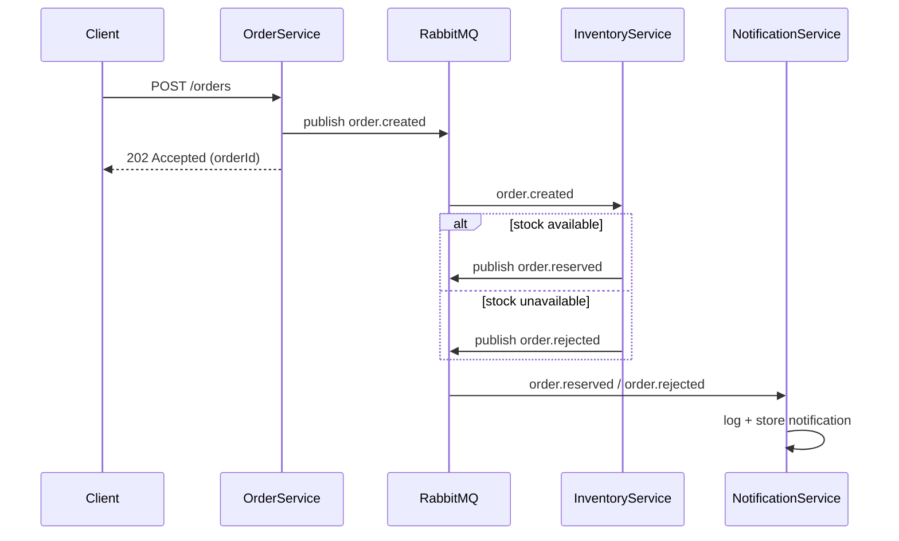

# Architecture

This document describes the messaging topology and event flow of the
demo. The code is the source of truth; this page mirrors it.

## Overview

Three services communicate exclusively through RabbitMQ events on a topic
exchange. No service calls another over HTTP; the only synchronous entry
points are OrderService's `POST /orders`, the read-only visibility
endpoints (`GET /stock`, `GET /notifications`), and health checks.



## Exchange topology

| Exchange    | Type   | Durable | Purpose                                          |
|-------------|--------|---------|--------------------------------------------------|
| `orders.topic` | topic  | yes     | All order lifecycle events                        |
| `orders.dlx`   | fanout | yes     | Dead-letter exchange for failed/poison messages   |

## Queues and bindings

| Queue                          | Bound to      | Routing key(s)   | Consumer           | Notes                                   |
|--------------------------------|---------------|------------------|--------------------|-----------------------------------------|
| `inventory.order-created`      | `orders.topic` | `order.created`  | InventoryService   | `x-dead-letter-exchange: orders.dlx`    |
| `notification.order-reserved`  | `orders.topic` | `order.reserved` | NotificationService|                                         |
| `notification.order-rejected`  | `orders.topic` | `order.rejected` | NotificationService|                                         |
| `orders.dead-letter`           | `orders.dlx`   | (fanout, no key) | none (inspect via management UI) | Terminal queue for poison messages |

## Routing keys

- `order.created`
- `order.reserved`
- `order.rejected`

## Event flow

1. Client sends `POST /orders` to OrderService.
2. OrderService validates the request shape, generates an `OrderId`
   (GUID), and publishes `order.created` to `orders.topic`.
3. Publishing uses **publisher confirms**; the HTTP response waits for
   the broker confirmation, then returns `202 Accepted` with the order
   ID. It never waits on downstream processing.
4. InventoryService consumes `order.created` (prefetch 10, manual ack,
   300-800 ms simulated processing delay):
   - SKU exists and quantity available: decrement stock atomically,
     publish `order.reserved`.
   - Unknown SKU or insufficient quantity: publish `order.rejected`
     with reason `unknown_sku` or `insufficient_stock`, then ack.
   - Body fails to deserialize or fails schema validation:
     `BasicNackAsync(requeue: false)` routes the message through the
     queue's dead-letter exchange to `orders.dead-letter`.
5. NotificationService consumes both outcome events, logs a structured
   notification line, and stores the record for `GET /notifications`.

## Event schemas

Consumers bind by JSON schema convention over routing keys, not by shared
compiled types. Payload classes live in each service's own `Models/`
folder on purpose; only `EventEnvelope` and `RabbitMqOptions` are shared.

`order.created`

```json
{
  "eventId": "guid",
  "eventType": "order.created",
  "occurredAt": "2026-08-25T12:00:00Z",
  "orderId": "guid",
  "sku": "SKU-WIDGET",
  "quantity": 1,
  "customerEmail": "a@b.com"
}
```

`order.reserved`

```json
{
  "eventId": "guid",
  "eventType": "order.reserved",
  "occurredAt": "2026-08-25T12:00:01Z",
  "orderId": "guid",
  "sku": "SKU-WIDGET",
  "quantity": 1,
  "remainingStock": 49
}
```

`order.rejected`

```json
{
  "eventId": "guid",
  "eventType": "order.rejected",
  "occurredAt": "2026-08-25T12:00:01Z",
  "orderId": "guid",
  "sku": "SKU-GIZMO",
  "reason": "insufficient_stock"
}
```

## Failure semantics

There are two distinct failure paths:

- **Malformed message** (invalid JSON or missing required fields):
  nacked without requeue, dead-letters via `orders.dlx` into
  `orders.dead-letter`. No retry, no side effects.
- **Business rejection** (unknown SKU / insufficient stock): *not* an
  error. InventoryService publishes `order.rejected` and acks the
  original message. There is deliberately no saga/compensation logic.

## Who declares what

Every service declares the topology pieces it depends on idempotently at
startup (durable, so restarts are no-ops), which is why
`docker compose up` works against a clean broker with no provisioning
step:

| Service              | Declares                                                                 |
|----------------------|--------------------------------------------------------------------------|
| OrderService         | exchanges `orders.topic`, `orders.dlx`                                    |
| InventoryService     | exchanges `orders.topic`, `orders.dlx`; queues `inventory.order-created`, `orders.dead-letter`; bindings |
| NotificationService  | exchange `orders.topic`; queues `notification.order-reserved`, `notification.order-rejected`; bindings |

Initial connections use an in-code retry loop with exponential backoff;
the compose `depends_on: service_healthy` gate alone is not enough
because the AMQP listener can lag the `rabbitmq-diagnostics ping`
healthcheck briefly.

## Competing consumers

InventoryService is horizontally scalable. Run multiple replicas with
`docker compose up --scale inventory-service=3` (see the README for the
port-mapping tradeoff) and RabbitMQ distributes messages from
`inventory.order-created` round-robin across consumers. The artificial
300-800 ms delay plus the container hostname in every log line make the
distribution visible in `docker compose logs -f`.
